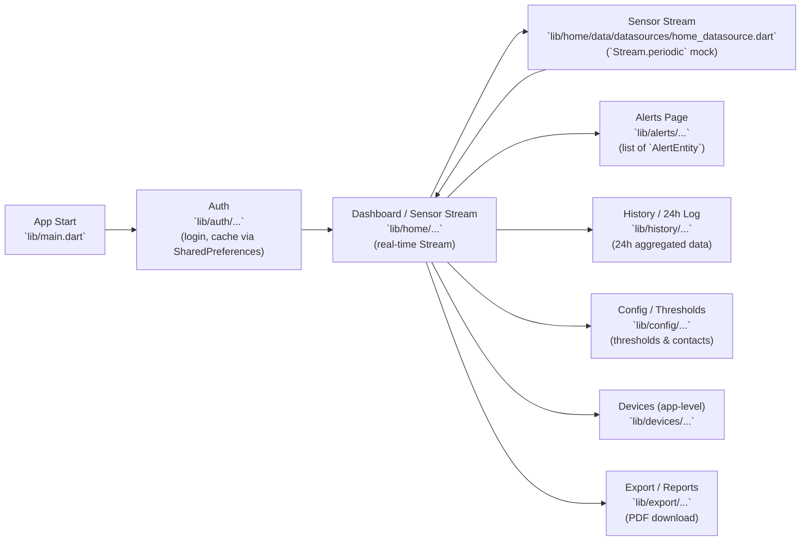

# Server Watcher
# Architecture & Flow — Single Page Diagram ✅

This single-page diagram summarizes the app flow and shows primary file references for each logical box (Auth, Sensor Stream, Alerts, History, Config, Devices, Export).

> Note: Many data sources are mock implementations (`*MockDataSourceImpl`) — replace them with real remote datasources when integrating a backend. 🔧

---

## Diagram (Mermaid)



---

## Box → Files mapping (quick reference)

- **App Start**
  - `lib/main.dart`

- **Auth** 🔐
  - `lib/auth/data/datasources/auth_datasource.dart` (login + cache)
  - `lib/auth/data/repositories/repo_impl.dart`
  - `lib/auth/presentation/bloc/auth_bloc.dart`
  - `lib/auth/presentation/pages/login_page.dart`

- **Home / Sensor Stream** 🌡️
  - `lib/home/data/datasources/home_datasource.dart` (`HomeMockDataSourceImpl` — stream)
  - `lib/home/data/repositories/home_repository_impl.dart`
  - `lib/home/presentation/bloc/home_bloc.dart` (subscribe & manage Stream)
  - `lib/home/presentation/pages/home_page.dart`
  - `lib/home/presentation/widgets/sensor_chart.dart`, `sensor_gauge.dart`

- **Alerts** 🚨
  - `lib/alerts/data/datasources/alerts_mock_data_source.dart`
  - `lib/alerts/data/repositories/alerts_repository_impl.dart`
  - `lib/alerts/presentation/bloc/alerts_bloc.dart`
  - `lib/alerts/presentation/pages/alerts_page.dart`

- **History / 24h Log** 📜
  - `lib/history/data/datasources/history_mock_data_source.dart`
  - `lib/history/data/repositories/history_repository_impl.dart`
  - `lib/history/presentation/bloc/history_bloc.dart`
  - `lib/history/presentation/pages/history_page.dart`

- **Config (Thresholds & Contacts)** ⚙️
  - `lib/config/data/datasources/config_mock_data_source.dart`
  - `lib/config/domain/usecases/get_thresholds_usecase.dart`
  - `lib/config/presentation/pages/config_page.dart`

- **Devices** 🖥️
  - `lib/devices/data/datasources/devices_mock_data_source.dart`
  - `lib/devices/data/repositories/devices_repository_impl.dart`
  - `lib/devices/presentation/bloc/devices_bloc.dart`

- **Export / Reports** 📦
  - `lib/export/data/datasources/export_mock_data_source.dart`
  - `lib/export/data/repositories/export_repository_impl.dart`
  - `lib/export/presentation/bloc/export_bloc.dart`
  - `lib/export/presentation/widgets/export_section.dart`

## Architecture Overview

The app follows **Clean Architecture** with three layers per feature:

```
Presentation  ←→  Domain  ←→  Data
(BLoC, Pages)     (UseCases,    (DataSources,
                   Entities,     Models,
                   Repos)        RepoImpl)
```

Data **always flows upward** through these layers:
> `Backend API` → `DataSource` → `RepositoryImpl` → `UseCase` → `BLoC` → `Widget`

---

## App Bootstrap — `main.dart`

This is the DI (Dependency Injection) root of the entire app. Everything is wired here manually.

```
SharedPreferences  ─┐
http.Client        ─┤──► AuthDataSourceImpl ──► AuthRepositoryImpl ──► AuthBloc (global)
                    └──► DevicesRemoteDataSourceImpl ──► DevicesRepositoryImpl ──► DevicesBloc (global)
```

**What happens at startup:**
1. `SharedPreferences` is loaded (contains cached auth token + user)
2. A single shared `http.Client` is created
3. `AuthBloc` is created and immediately fires `AuthCheckCacheRequested` — checks if the user is already logged in from a previous session
4. `DevicesBloc` is created and immediately fires `LoadDevices` — starts fetching device list and begins 30-second polling for live statuses
5. The GoRouter is created, referencing `AuthBloc.stream` so navigation reacts to auth state changes
6. Both blocs are provided globally via `MultiBlocProvider`, making them accessible from any widget in the tree

> [!IMPORTANT]
> `AuthBloc` and `DevicesBloc` are the only **globally-provided, app-lifetime** blocs. All other blocs (Home, History, Alerts, Config, Users) are created locally within their respective pages.

---

## Router — `app_router.dart`

The router is **auth-aware** — it listens to `AuthBloc.stream` via `GoRouterRefreshStream`.

| Route | Auth Required | Admin Only |
|---|---|---|
| `/login` | No | No |
| `/dashboard` | Yes | No |
| `/history` | Yes | No |
| `/alerts` | Yes | No |
| `/config` | Yes | **Yes** |
| `/devices` | Yes | **Yes** |
| `/users` | Yes | **Yes** |

**Guard logic:**
- If `AuthState` is NOT `AuthSuccess` → redirects any protected route to `/login`
- If `AuthState` IS `AuthSuccess` and user visits `/login` → redirects to `/dashboard`
- For admin routes, checks `user.role == 'ADMIN'`, else redirects to `/dashboard`

The `user` object (from `AuthSuccess.user`) is passed directly as a constructor parameter to each page, so pages know the current user's role without re-reading the BLoC.

---

## BLoC 1: `AuthBloc` (Global)

**Purpose:** Manages authentication state across the entire app lifetime.

### Events
| Event | Payload | Triggered By |
|---|---|---|
| `AuthCheckCacheRequested` | — | App startup (main.dart) |
| `AuthLoginRequested` | `username`, `password` | Login page form submit |
| `AuthLogoutRequested` | — | Any logout button |

### States
| State | Contains | Meaning |
|---|---|---|
| `AuthInitial` | — | App just launched / logged out |
| `AuthLoading` | — | Login in progress |
| `AuthSuccess` | `UserEntity` (username, role, token) | Authenticated |
| `AuthFailure` | `String message` | Login failed |

### Data Flow (Login)
```
LoginPage
  ├─ User taps Login
  ├─ add(AuthLoginRequested(username, password))
  │
AuthBloc.on<AuthLoginRequested>
  ├─ emit(AuthLoading)
  ├─ loginUseCase.call(username, password)
  │     └─ AuthRepository.login()
  │           └─ AuthDataSource.loginUser()  ──► POST /login  ──► Server
  │           └─ AuthDataSource.cacheUser()  ──► SharedPreferences (saves token)
  ├─ emit(AuthSuccess(UserEntity))
  │
GoRouter         ── sees AuthSuccess ──► redirects to /dashboard
LoginPage        ── BlocListener sees AuthSuccess ──► navigates
```

### Data Flow (Cache Check at Startup)
```
main.dart → AuthBloc..add(AuthCheckCacheRequested)
  └─ checkAuthStatusUseCase.call()
        └─ AuthRepository.getLastLoggedInUser()
              └─ AuthDataSource.getLastUser()  ──► SharedPreferences.getString(...)
  └─ If found → emit(AuthSuccess)  → GoRouter redirects to /dashboard
     If not   → stays at AuthInitial → GoRouter redirects to /login
```

### Data Provided to the App
- `UserEntity.role` → Gate-keeps admin pages in the router
- `UserEntity.token` → Stored in SharedPreferences, read by `_getHeaders()` in every other DataSource
- `UserEntity.username` → Displayed in UI header/sidebar
- `UserEntity` object → Passed as constructor param to every page by the router

---

## BLoC 2: `DevicesBloc` (Global)

**Purpose:** Manages the global list of IoT devices and their live status. Runs 30-second polling.

### Events
| Event | Payload | Triggered By |
|---|---|---|
| `LoadDevices` | — | Startup, after add/update/remove |
| `SelectDevice` | `deviceId` | Horizontal device list tap |
| `AddDeviceRequested` | `roomName` | Device manager form |
| `UpdateDeviceRequested` | `id`, `newRoomName` | Device manager edit |
| `RemoveDeviceRequested` | `id` | Device manager delete |
| `RefreshDeviceStatuses` | — | Auto-fired after load, every 30s |

### States
| State | Contains | Meaning |
|---|---|---|
| `DevicesLoading` | — | Fetching data |
| `DevicesLoaded` | `List<DeviceEntity>`, `selectedDeviceId?`, `Map<String,DeviceStatusInfo>` | Ready |
| `DevicesOperationSuccess` | `String message` | CRUD succeeded |
| `DevicesError` | `String message` | Something failed |

### Data Flow (Initial Load)
```
main.dart → DevicesBloc..add(LoadDevices())
  ├─ emit(DevicesLoading)
  ├─ getDevices()  ──► GET /admin/devices/  ──► Server
  ├─ emit(DevicesLoaded(devices, selectedDeviceId = devices.first.id))
  ├─ add(RefreshDeviceStatuses())          ← immediate first status poll
  └─ Timer.periodic(30s) → add(RefreshDeviceStatuses())  ← ongoing polling
```

### Data Flow (Status Polling)
```
RefreshDeviceStatuses event
  ├─ refreshDeviceStatuses(ids)
  │     └─ DevicesDataSource.getDeviceStatuses([id1, id2, ...])
  │           └─ Future.wait(ids.map(id → GET /status/:id))  ──► Server (parallel)
  │           └─ Returns Map<deviceId, DeviceStatusInfo(state, alertActive)>
  └─ emit(current.copyWith(deviceStatuses: statuses))  ← silent update, no loading flash
```

### Data Provided to the App
- `List<DeviceEntity>` → Rendered in the horizontal device picker across Home, History, and Alerts pages
- `selectedDeviceId` → The currently highlighted device; pages react to changes
- `DeviceStatusInfo.state` → "online" / "dead" / "unknown" badge per device card
- `DeviceStatusInfo.alertActive` → Red alert indicator on device card
- On `AddDeviceRequested` → Downloads firmware `.ino` file to user's device via `FileSaver`

> [!NOTE]
> The `DevicesBloc` does NOT own sensor data — it only owns the device registry and connectivity status. Live sensor readings are managed by `HomeBloc`.

---

## BLoC 3: `HomeBloc` (Page-local)

**Purpose:** Manages real-time sensor data (temperature, humidity) for a selected device. Uses a polling stream (every 2 seconds).

### Events
| Event | Payload | Triggered By |
|---|---|---|
| `HomeInitialLoad` | — | `HomePage.initState()` |
| `HomeDeviceChanged` | `deviceId` | Widget listening to DevicesBloc selection changes |
| `HomeDataUpdated` | `SensorData` | Internal — fired by the sensor stream |
| `HomeStopPolling` | — | Page dispose or manual stop |

### States
| State | Contains | Meaning |
|---|---|---|
| `HomeLoading` | — | Fetching thresholds |
| `HomeLoaded` | `selectedDeviceId`, `List<SensorData>` (max 20), `ThresholdsEntity` | Live data ready |
| `HomeError` | `String` | Failed to load thresholds |

### Data Flow
```
HomePage opens
  ├─ add(HomeInitialLoad)
  │     ├─ getThresholdsUseCase() ──► GET /config/thresholds ──► Server
  │     └─ emit(HomeLoaded(selectedDeviceId="", sensorData=[], thresholds))
  │
  ├─ BlocListener on DevicesBloc
  │     └─ when DevicesLoaded → add(HomeDeviceChanged(state.selectedDeviceId))
  │
  └─ HomeDeviceChanged handler
        ├─ subscribeToDevice(deviceId)
        │     └─ getSensorStreamUseCase.call(deviceId)
        │           └─ HomeDataSource.getSensorStream(deviceId)
        │                 └─ Loop every 2s: GET /metrics/latest/:deviceId ──► Server
        │                       └─ pushes SensorModel into StreamController
        │
        └─ Stream pushes data → sensorSubscription.listen
              └─ add(HomeDataUpdated(data))
                    └─ emit(HomeLoaded with updated sensorData list, max 20 items)
```

### Data Provided to UI
- `List<SensorData>` → Live rolling chart of temperature/humidity readings (capped at 20 points)
- `ThresholdsEntity` → Lines drawn on the chart showing warning/critical thresholds
- `selectedDeviceId` → Highlights which device is being watched

> [!TIP]
> The sensor polling stream auto-cancels when `HomeDeviceChanged` fires with a new device ID. It also cancels when the bloc is closed (page disposed).

---

## BLoC 4: `HistoryBloc` (Page-local)

**Purpose:** Fetches historical sensor data for a selected device.

### Events
| Event | Payload |
|---|---|
| `HistoryInitialLoad` | — |
| `HistoryDeviceChanged` | `deviceId` |

### States
| State | Contains |
|---|---|
| `HistoryLoading` | — |
| `HistoryLoaded` | `selectedDeviceId`, `historyData` |
| `HistoryError` | `String` |

### Data Flow
```
HistoryPage opens → add(HistoryInitialLoad) → emit(HistoryLoading)
  
DevicesBloc listener → user selects device
  → add(HistoryDeviceChanged(deviceId))
        → getHistoryUseCase.call(deviceId) ──► GET /metrics/:deviceId ──► Server
        → emit(HistoryLoaded(deviceId, historyData))
```

---

## BLoC 5: `AlertsBloc` (Page-local)

**Purpose:** Fetches triggered alert records for a selected device.

### Events
| Event | Payload |
|---|---|
| `AlertsInitialLoad` | — |
| `AlertsDeviceChanged` | `deviceId` |

### States
| State | Contains |
|---|---|
| `AlertsLoading` | — |
| `AlertsLoaded` | `selectedDeviceId`, `List<AlertEntity>` |
| `AlertsError` | `String` |

### Data Flow
```
AlertsPage opens → add(AlertsInitialLoad) → emit(AlertsLoading)

DevicesBloc listener → device selected
  → add(AlertsDeviceChanged(deviceId))
        → getAlertsUseCase.call(deviceId) ──► GET /alerts/:deviceId ──► Server
        → emit(AlertsLoaded(deviceId, alerts))
```

> [!NOTE]
> `AlertsBloc` currently uses a mock datasource (`alerts_mock_data_source.dart`). The alerts data is not coming from the real API yet.

---

## BLoC 6: `ConfigBloc` (Page-local, Admin only)

**Purpose:** Manages sensor alert thresholds and admin notification contacts (emails + phone numbers).

### Events
| Event | Payload |
|---|---|
| `ConfigInitialLoad` | — |
| `SubmitThresholds` | `subTemp`, `thresTemp`, `subHum`, `thresHum` |
| `AddEmailEvent` | `email` |
| `RemoveEmailEvent` | `email` |
| `AddPhoneEvent` | `phone` |
| `RemovePhoneEvent` | `phone` |

### States
| State | Contains |
|---|---|
| `ConfigInitial` | — |
| `ConfigLoading` | — |
| `ConfigLoaded` | `ThresholdsEntity`, `ContactEntity` |
| `ConfigSuccess` | `String message` |
| `ConfigFailure` | `String error` |

### Data Flow
```
ConfigPage opens → add(ConfigInitialLoad)
  └─ Future.wait([getThresholdsUseCase(), getContactsUseCase()])
        ├─ GET /config/thresholds ──► ThresholdsEntity
        └─ GET /config/contacts   ──► ContactEntity
  → emit(ConfigLoaded(thresholds, contacts))

User submits threshold form → add(SubmitThresholds(...))
  → updateThresholdsUseCase(entity) ──► PUT /config/thresholds
  → emit(ConfigSuccess)
  → add(ConfigInitialLoad)  ← auto-reloads

User adds/removes email or phone → corresponding event
  → API call ──► Server
  → emit(ConfigSuccess)
  → add(ConfigInitialLoad)  ← auto-reloads
```

---

## BLoC 7: `UsersBloc` (Page-local, Admin only)

**Purpose:** Manages the list of users (create, delete, list).

### Events
| Event | Payload |
|---|---|
| `LoadUsers` | — |
| `CreateUserRequested` | `username`, `password`, `role` |
| `DeleteUserRequested` | `username` |

### States
| State | Contains |
|---|---|
| `UsersLoading` | — |
| `UsersLoaded` | `List<UserEntity>` |
| `UserOperationSuccess` | `String message` |
| `UsersError` | `String message` |

### Data Flow
```
UserManagementPage opens → add(LoadUsers)
  → getUsersUseCase() ──► GET /admin/users ──► Server
  → emit(UsersLoaded(users))

Admin creates user → add(CreateUserRequested(...))
  → createUserUseCase(username, password, role) ──► POST /admin/users
  → emit(UserOperationSuccess)
  → add(LoadUsers)  ← refreshes list

Admin deletes user → add(DeleteUserRequested(username))
  → deleteUserUseCase(username) ──► DELETE /admin/users/:username
  → emit(UserOperationSuccess)
  → add(LoadUsers)  ← refreshes list
```

---

## Cross-BLoC Communication Pattern

The app uses a clean **"listen and forward"** pattern to pass the selected device between blocs without direct coupling:

```
DevicesBloc (global)
    │
    │  emits DevicesLoaded(selectedDeviceId: "abc")
    ▼
BlocListener in HomePage/HistoryPage/AlertsPage
    │
    │  listens for DevicesLoaded state changes
    │  extracts state.selectedDeviceId
    ▼
Local BLoC (HomeBloc / HistoryBloc / AlertsBloc)
    │
    │  add(HomeDeviceChanged("abc"))
    │  add(HistoryDeviceChanged("abc"))
    │  add(AlertsDeviceChanged("abc"))
    ▼
Fetches data specific to that device
```

This means: **only one device selection exists at a time** (owned by `DevicesBloc`), and every page reacts to it independently.

---

## Complete Data Flow Summary Table

| BLoC | Scope | Data Source | API Endpoints Used | What UI Gets |
|---|---|---|---|---|
| `AuthBloc` | Global | REST + SharedPrefs | `POST /login` | UserEntity (username, role, token) |
| `DevicesBloc` | Global | REST | `GET/POST/PUT/DELETE /admin/devices/`, `GET /status/:id` | Device list, live status badges |
| `HomeBloc` | Page | REST (streaming poll) | `GET /metrics/latest/:id`, `GET /config/thresholds` | Rolling sensor chart (20 pts) + thresholds |
| `HistoryBloc` | Page | REST | `GET /metrics/:id` | Historical sensor table/chart |
| `AlertsBloc` | Page | Mock | *(not real yet)* | Alert event list |
| `ConfigBloc` | Page (Admin) | REST | `GET/PUT /config/thresholds`, `GET/POST/DELETE /config/contacts` | Threshold sliders, contact lists |
| `UsersBloc` | Page (Admin) | REST | `GET/POST/DELETE /admin/users` | User table with create/delete |

---

## Authentication Token Flow

The JWT token is the connective tissue between Auth and all other data:

```
AuthBloc.AuthSuccess
    |
    ▼ 
SharedPreferences.setString('auth_token', token)
                    |
                    ▼
    DevicesDataSource._getHeaders()
    HomeDataSource._getHeaders()
    HistoryDataSource._getHeaders()  ← each reads token from SharedPreferences
    AlertsDataSource._getHeaders()
    ConfigDataSource._getHeaders()
    UsersDataSource._getHeaders()
                    |
                    ▼
    Authorization: Bearer <token>  → sent with every API request
```
