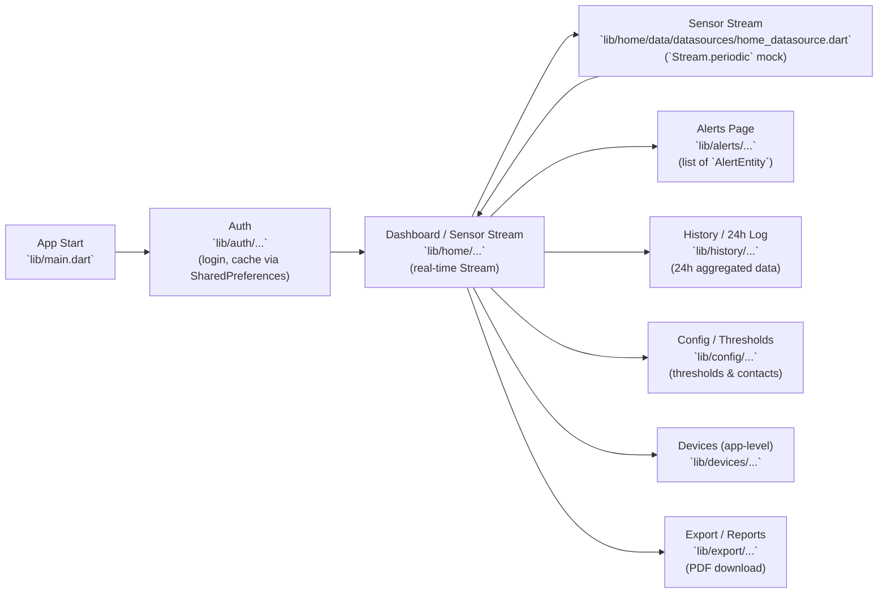

# Architecture & Flow — Single Page Diagram ✅

This single-page diagram summarizes the app flow and shows primary file references for each logical box (Auth, Sensor Stream, Alerts, History, Config, Devices, Export).

> Note: Many data sources are mock implementations (`*MockDataSourceImpl`) — replace them with real remote datasources when integrating a backend. 🔧

---

## Diagram (Mermaid)

---

## Box → Files mapping (quick reference)

- **App Start**
  - `lib/main.dart`

- **Auth** 🔐
  - `lib/auth/data/datasources/auth_datasource.dart` (login + cache)
  - `lib/auth/data/repositories/repo_impl.dart`
  - `lib/auth/presentation/bloc/auth_bloc.dart`
  - `lib/auth/presentation/pages/login_page.dart`

- **Home / Sensor Stream** 🌡️
  - `lib/home/data/datasources/home_datasource.dart` (`HomeMockDataSourceImpl` — stream)
  - `lib/home/data/repositories/home_repository_impl.dart`
  - `lib/home/presentation/bloc/home_bloc.dart` (subscribe & manage Stream)
  - `lib/home/presentation/pages/home_page.dart`
  - `lib/home/presentation/widgets/sensor_chart.dart`, `sensor_gauge.dart`

- **Alerts** 🚨
  - `lib/alerts/data/datasources/alerts_mock_data_source.dart`
  - `lib/alerts/data/repositories/alerts_repository_impl.dart`
  - `lib/alerts/presentation/bloc/alerts_bloc.dart`
  - `lib/alerts/presentation/pages/alerts_page.dart`

- **History / 24h Log** 📜
  - `lib/history/data/datasources/history_mock_data_source.dart`
  - `lib/history/data/repositories/history_repository_impl.dart`
  - `lib/history/presentation/bloc/history_bloc.dart`
  - `lib/history/presentation/pages/history_page.dart`

- **Config (Thresholds & Contacts)** ⚙️
  - `lib/config/data/datasources/config_mock_data_source.dart`
  - `lib/config/domain/usecases/get_thresholds_usecase.dart`
  - `lib/config/presentation/pages/config_page.dart`

- **Devices** 🖥️
  - `lib/devices/data/datasources/devices_mock_data_source.dart`
  - `lib/devices/data/repositories/devices_repository_impl.dart`
  - `lib/devices/presentation/bloc/devices_bloc.dart`

- **Export / Reports** 📦
  - `lib/export/data/datasources/export_mock_data_source.dart`
  - `lib/export/data/repositories/export_repository_impl.dart`
  - `lib/export/presentation/bloc/export_bloc.dart`
  - `lib/export/presentation/widgets/export_section.dart`

---

## How to view / edit
- GitHub and many Markdown viewers support **Mermaid** diagrams; open `docs/architecture_flow.md` to see the rendered diagram. 💡
- To edit, update the mermaid block or the mapping section in this file and commit.

---

_Last updated: Feb 03, 2026_
